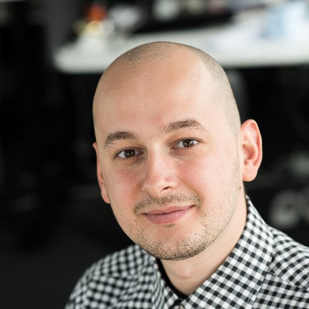
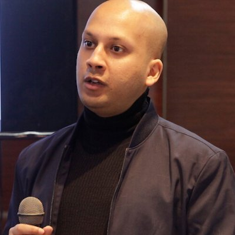
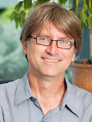

---

The sessions will run from 9am PST to 12pm PST on December 7-8, 2021.  All times below are in PST (Los Angeles time).  Links to attend the sessions will be emailed privately after [registration](https://usc.zoom.us/webinar/register/WN_V-mMUlHGQMWnkecKyPUQWA).

## Tuesday December 7, 2021

| Start | End | Session |  |
| ---- | ---- | --------- | ------------------- |   
| 9:00 | 9:15 | **Welcome and Opening Remarks**  |  |
|  |  | [Filip Ilievski](https://usc-isi-i2.github.io/ilievski/)   Computer Scientist, Information Sciences Institute, School of Engineering |  |
| 10:00 | 11:00 | **Session I: Common Sense Reasoning**  |  |
|  |  | *Explaining with Common Sense*   [Xiang Ren](http://ink-ron.usc.edu/xiangren/)   Assistant Professor of Computer Science, Viterbi School of Engineering; Research Lead, Information Sciences Institute, Viterbi School of Engineering	 |  |
|  |  | *Predicting Events*   [Manuel Ciosici](https://scholar.google.com/citations?user=vseIg5YAAAAJ&hl=en)   Postdoctoral Researcher, Information Sciences Institute, School of Engineering |  |
|  |  | *Visual Grounding*   [Ram Nevatia](https://sites.usc.edu/iris-cvlab/professor-ram-nevatia/)   Fletcher Jones Professor in Computer Science and Professor of Computer Science and Electrical and Computer Engineering |  |
|  |  | *Open-world Agents*   [Filip Ilievski](https://usc-isi-i2.github.io/ilievski/)   Computer Scientist, Information Sciences Institute, University of Southern California |  |
| 10:00 | 10:15 | **Break**  |  |
| 10:15 | 11:00 | **Session II: Organizing Common Sense**  |  |
|  |  | *Dimensions of Common Sense*   [Pedro Szekely](https://usc-isi-i2.github.io/szekely/)   Principal Scientist and Director of the AI Division, USC/ISI;  Research Associate Professor, USC Viterbi School of Engineering |  |
|  |  | *Learning Common Sense*   [Marjorie Freedman](https://www.isi.edu/people/mrf/about)   Research Lead, Information Sciences Institute, Viterbi School of Engineering |  |
|  |  | *From Data to Common Sense*   [Muhao Chen](https://muhaochen.github.io/)    Assistant Research Professor of Computer Science |  |
|  |  | *Crowdsourced Common Sense*   [Yolanda Gil](https://www.isi.edu/~gil/)   Senior Director, Information Sciences Institute, Viterbi School of Engineering; Director, Data Science Programs, Computer Science Department, Viterbi School of Engineering; Research Professor of Computer Science, Viterbi School of Engineering; Research Professor of Spatial Sciences, Dornsife College of Letters, Arts and Sciences |  |
| 11:00 | 11:15 | **Break**  |  |
| 11:15 | 12:00 | **Invited Talk: TBD** | |

## Wednesday December 8, 2021

| Start | End | Session |  |
| ---- | ---- | --------- | ------------------- |   
| 9:00 | 9:45 | **Session III: Common Sense for Creativity** |  |
|  |  | *Generating New Ideas*   [Mayank Kejriwal](https://usc-isi-i2.github.io/kejriwal/)   Research Assistant Professor of Computer Science, Information Sciences Institute, Viterbi School of Engineering |  |
|  |  | *Biases in Common Sense*   [Fred Morstatter](https://isi.edu/~fredmors/)   Research Assistant Professor of Computer Science, Information Sciences Institute, Viterbi School of Engineering |  |
|  |  | *Explaining Stories and Dialogues*   [Jay Pujara](https://www.jaypujara.org/)   Director, Center on Knowledge Graphs; Research Assistant Professor, Computer Science; Research Lead, Information Sciences Institute |  |
|  |  | *Transferring Knowledge*   [Jon May](https://www.isi.edu/~jonmay/)   Research Lead, Information Sciences Institute, Viterbi School of Engineering; Research Assistant Professor of Computer Science, Viterbi School of Engineering |  |
| 9:45 | 10:00 | **Break**  |  |
| 10:00 | 10:45 | **Session IV: Common Sense in AI Agents and Robots** |  |
|  |  | *Modeling Emotions*   [Jon Gratch](https://ict.usc.edu/profile/jonathan-gratch/)   Director for Virtual Humans Research, Institute for Creative Technologies; Research Professor, USC Viterbi School of Engineering Computer Science Department |  |
|  |  | *Self-Diagnosis of Robot Failures*   [Stefanos Nikolaidis](https://stefanosnikolaidis.net/)   Assistant Professor of Computer Science |  |
|  |  | *Trust and Deception in Robots*   [Maja Mataric](https://robotics.usc.edu/~maja/)   USC Interim Vice President of Research; Chan Soon-Shiong Chair and Distinguished Professor of Computer Science, Neuroscience, and Pediatrics |  |
|  |  | *User-Centric Explanations*   [Mike Pazzani](https://www.isi.edu/directory/pazzani/)   Principal Scientist, Information Sciences Institute |  |
| 10:45 | 11:00 | **Break**  |  |
| 11:00 | 11:45 | **Panel: Common Sense and Artificial General Intelligence**  |  |
|  |  | Panel Moderator: [Mayank Kejriwal](https://usc-isi-i2.github.io/kejriwal/)   Research Assistant Professor of Computer Science, Information Sciences Institute, Viterbi School of Engineering |  |
| 11:45 | 12:00 | **Closing Remarks**  |  |
|  |  | [Yolanda Gil](https://www.isi.edu/~gil/)   Senior Director, Information Sciences Institute, Viterbi School of Engineering; Director, Data Science Programs, Computer Science Department, Viterbi School of Engineering; Research Professor of Computer Science, Viterbi School of Engineering; Research Professor of Spatial Sciences, Dornsife College of Letters, Arts and Sciences |   |
