---

The sessions will run from 8:45am PST to 12:15 PST on May 3-5, 2021.  All times below are in PST (Los Angeles time).  Links to attend the sessions will be emailed privately after [registration](https://usc.zoom.us/webinar/register/WN_V-mMUlHGQMWnkecKyPUQWA).

## Monday May 3, 2021

| Start | End | Session |  |
| ---- | ---- | --------- | ------------------- |   
| 8:45 | 9:00 | **Welcome and Opening Remarks**  |  |
|  |  | [Yannis Yortsos](https://viterbi.usc.edu/directory/faculty/Yortsos/Yannis)   Zohrab A. Kaprielian Dean’s Chair in Engineering and Chester Dolley Professor of Chemical and Petroleum Engineering | 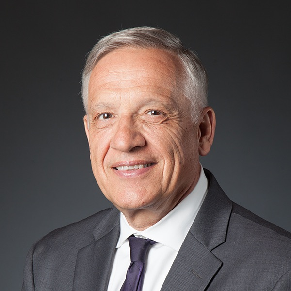 |
|  |  | [Craig Knoblock](https://usc-isi-i2.github.io/knoblock/)   Keston Executive Director, Information Sciences Institute, Viterbi School of Engineering; Vice Dean of Engineering, Viterbi School of Engineering; Research Professor of Computer Science, Viterbi School of Engineering; Research Professor of Spatial Sciences, Dornsife College of Letters, Arts and Sciences |  |
| 9:00 | 9:45 | **Invited Talk I: [Jeannette Wing](https://www.cs.columbia.edu/~wing/), Columbia University**   Professor of Computer Science, The Fu Foundation School of Engineering and Applied Science; Avanessians Director, Data Science Institute |  |
| 9:45 | 10:00 | **Break**  |  |
| 10:00 | 11:00 | **Session I: Data Everywhere**  |  |
|  |  | Session Chair: [Wael AbdAlmageed](https://www.isi.edu/people/wamageed/)   Research Associate Professor in Electrical and Computer Engineering, Viterbi School of Engineering; Research Team Leader, Information Sciences Institute, Viterbi School of Engineering  | 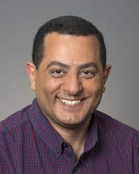 |
|  |  | *Text Analysis in Finance*   [Gerard Hoberg](http://faculty.marshall.usc.edu/Gerard-Hoberg/)   Professor of Finance, Marshall School of Business |  |
|  |  | *Image Analysis in Neuroscience*   [Paul Thompson](http://users.loni.usc.edu/~thompson/thompson.html)   Professor of Ophthalmology, Neurology, Psychiatry and the Behavioral Sciences, Radiology, Psychiatry, and Engineering, Keck School of Medicine   Associate Director, USC Mark and Mary Stevens Neuroimaging and Informatics Institute, Keck School of Medicine |  |
|  |  | *New Eyes on Our Cities*   [Seon Kim](https://sites.google.com/view/skim-home/home)   Research Scientist, Integrated Media Systems Center, Viterbi School of Engineering |  |
|  |  | *Spatial Data for Transportation*   [Yao-Yi Chiang](https://yaoyichi.github.io)   Associate Professor (Research), Spatial Sciences Institute, Dornsife College of Letters, Arts and Sciences |  |
|  |  | *Discrimination in Ad Delivery*   [Aleksandra Korolova](https://www.korolova.com)   Assistant Professor of Computer Science, Viterbi School of Engineering |  |
| 11:00 | 11:15 | **Break**  |  |
| 11:15 | 12:00 | **Panel I: Sustainability**  |  |
|  |  | Panel Chair: [Chris Mattmann](http://irds.usc.edu/faculty/mattmann/)   Division Manager, Artificial Intelligence, Analytics and Innovation Development Organization, Information Technology and Solutions Directorate, NASA JPL; Director, Apache Software Foundation; Director, Information Retrieval & Data Science group, Viterbi School of Engineering; Adjunct Research Associate Professor of Computer Science, Viterbi School of Engineering  |  |
|  |  | [Deborah Khider](https://earth.usc.edu/~khider/)   Research Scientist, Information Sciences Institute, Viterbi School of Engineering |  |
|  |  | [Mahta Moghaddam](https://viterbi.usc.edu/directory/faculty/Moghaddam/Mahta)   Ming Hsieh Chair, Electrical and Computer Engineering-Electrophysics, Viterbi School of Engineering; Distinguished Professor, Electrical and Computer Engineering, Viterbi School of Engineering |  |
|  |  | [John Wilson](https://johnwilson.usc.edu)   Director, Spatial Sciences Institute, Dornsife College of Letters, Arts and Sciences; Director, Wilson Map Lab; Professor of Architecture, Civil and Environmental Engineering, Computer Science, Preventive Medicine, Sociology, and Spatial Sciences, Dornsife College of Letters, Arts and Sciences |  |
| 12:00 | 12:15 | **Teaching I: Interdisciplinary Data Science**  |  |
|  |  | [Gary Painter](https://priceschool.usc.edu/people/gary-dean-painter/)  Chair, Department of Public Policy, Sol Price School of Public Policy; Director, Sol Price Center for Social Innovation, Sol Price School of Public Policy; Director, Homelessness Policy Research Institute, Sol Price School of Public Policy; Professor, Sol Price School of Public Policy |  |
|  |  | [Yolanda Gil](https://www.isi.edu/~gil/)   Senior Director, Information Sciences Institute, Viterbi School of Engineering; Director, Data Science Programs, Computer Science Department, Viterbi School of Engineering; Research Professor of Computer Science, Viterbi School of Engineering; Research Professor of Spatial Sciences, Dornsife College of Letters, Arts and Sciences |  |

## Tuesday May 4, 2021

| Start | End | Session |  |
| ---- | ---- | --------- | ------------------- |   
| 8:45 | 9:00 | **Teaching II: Data Science and Artificial Intelligence**  |  |
|  |  | [Cyrus Shahabi](https://infolab.usc.edu/Shahabi/)   Chair, Computer Science Department, Viterbi School of Engineering; Director, Integrated Media Systems Center, Viterbi School of Engineering; Director, Information Laboratory, Viterbi School of Engineering; Professor of Computer Science and Electrical Engineering, Viterbi School of Engineering; Research Professor of Spatial Sciences, Dornsife College of Letters, Arts and Sciences | 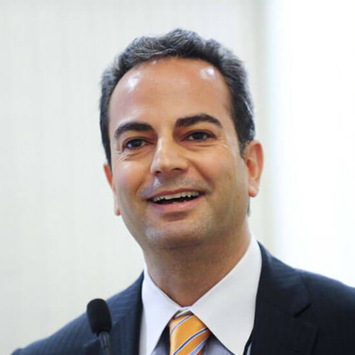 |
|  |  | [Emilio Ferrara](http://www.emilio.ferrara.name/), Associate Professor of Communication, Annenberg School of Communication; Associate Professor of Computer Science, Viterbi School of Engineering; Associate Director of Applied Data Science, Viterbi School of Engineering; Research Team Leader, Information Sciences Institute, Viterbi School of Engineering  |  |
| 9:00 | 10:00 | **Session II: Modeling Behaviors** |  |
|  |  | Session Chair: [Emilio Ferrara](http://www.emilio.ferrara.name/), Associate Professor of Communication, Annenberg School of Communication; Associate Professor of Computer Science, Viterbi School of Engineering; Associate Director of Applied Data Science, Viterbi School of Engineering; Research Team Leader, Information Sciences Institute, Viterbi School of Engineering  |  |
|  |  | *Morality Maps*   [Morteza Dehghani](http://morteza-dehghani.net)   Associate Professor of Psychology, Computer Science and Brain and Creativity Institute, Dornsife College of Letters, Arts and Sciences | 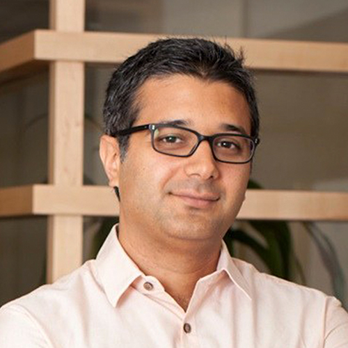 |
|  |  | *Successful Teaming*   [Marlon Twyman](https://www.marlontwyman.com)   Assistant Professor of Communication, Annenberg School for Communication and Journalism | 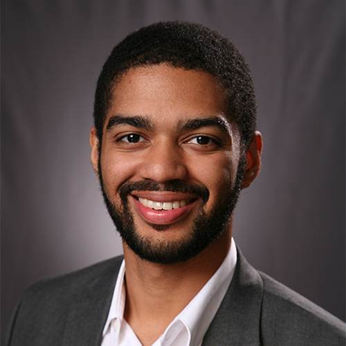 |
|  |  | *Emerging Cultural Identities*   [Fred Morstatter](https://isi.edu/~fredmors/)   Research Assistant Professor of Computer Science, Information Sciences Institute, Viterbi School of Engineering |  |
|  |  | *Social Networks and Bias*   [Kristina Lerman](https://www.isi.edu/integration/people/lerman/)   Project Lead, Information Sciences Institute, Viterbi School of Engineering; Research Associate Professor of Computer Science, Viterbi School of Engineering | 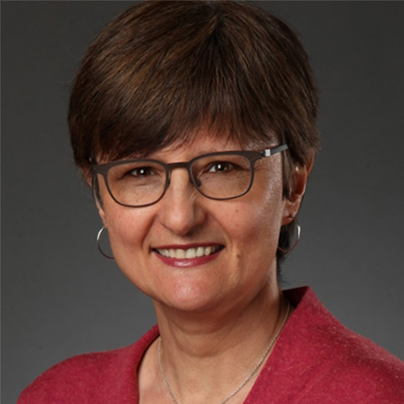 |
|  |  | *From Wearables to Behaviors*   [Shri Narayanan](https://viterbi.usc.edu/directory/faculty/Narayanan/Shrikanth)   Professor of Electrical and Computer Engineering and Computer Science, Viterbi School of Engineering; Professor of Linguistics, Psychology and Neuroscience, Dornsife College of Letters, Arts and Sciences; Professor of Pediatrics, Otolaryngology-Head and Neck Surgery, Keck School of Medicine; Research Director, Information Sciences Institute, Viterbi School of Engineering |  |
| 10:00 | 10:15 | **Break**  |  |
| 10:15 | 11:00 | **Poster Session**  |  |
| 11:00 | 11:15 | **Break**  |  |
| 10:15 | 12:15 | **Session III: Language Diversity**  |  |
|  |  | Session Chair: [Elizabeth Boschee](https://www.isi.edu/about/bio/elizabeth_boschee/), Research Team Leader and Director of the Boston Office, Information Sciences Institute, Viterbi School of Engineering  |  |
|  |  | *Translation for All*   [Jon May](https://www.isi.edu/~jonmay/)   Research Lead, Information Sciences Institute, Viterbi School of Engineering; Research Assistant Professor of Computer Science, Viterbi School of Engineering | 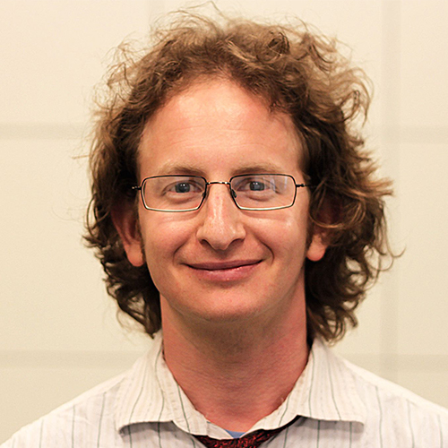 |
|  |  | *Multimedia Extraction*   [Marjorie Freedman](https://www.isi.edu/people/mrf/about)   Research Lead, Information Sciences Institute, Viterbi School of Engineering | 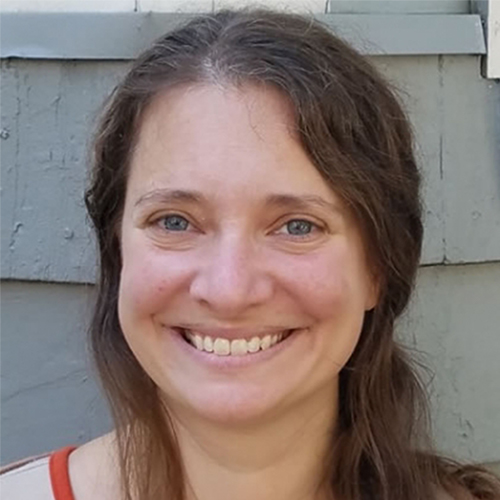 |
|  |  | *Common Knowledge*   [Filip Ilievski](https://usc-isi-i2.github.io/ilievski/)   Computer Scientist, Information Sciences Institute, Viterbi School of Engineering |  |
|  |  | *Reasoning About Events*   [Xiang Ren](http://ink-ron.usc.edu/xiangren/)   Assistant Professor of Computer Science, Viterbi School of Engineering; Research Lead, Information Sciences Institute, Viterbi School of Engineering |  |
|  |  | *No Questions Unanswered*   [Ralph Weischedel](https://www.isi.edu/people/weisched/about)   Research Team Leader, Information Sciences Institute, Viterbi School of Engineering | 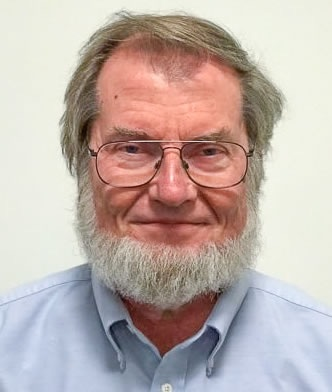 |

## Wednesday May 5, 2021

| Start | End | Session |  |
| ---- | ---- | --------- | ------------------- |   
| 9:00 | 10:00 | **Session IV: Making Decisions**  |  |
|  |  | Session Chair: [Jose Luis Ambite](https://www.isi.edu/~ambite/), Research Associate Professor of Computer Science, Viterbi School of Engineering; Research Team Leader, Information Sciences Institute, Viterbi School of Engineering  | 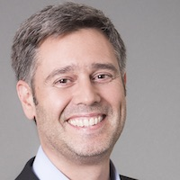 |
|  |  | *Learning to Decide*   [Bistra Dilkina](https://viterbi.usc.edu/directory/faculty/Dilkina/Bistra)   Associate Professor of Computer Science, Viterbi School of Engineering; Co-Director, Center for AI in Society, Viterbi School of Engineering and Dworak-Peck School of Social Work | 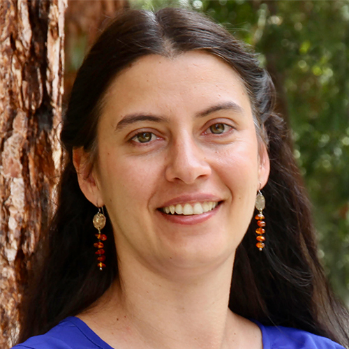 |
|  |  | *Constraint Optimization*   [Satish Thittamaranahalli](http://www.tkskwork.org)   Research Lead, Information Sciences Institute, Viterbi School of Engineering; Research Assistant Professor of Computer Science, Industrial and Systems Engineering, and Physics and Astronomy, Viterbi School of Engineering |  |
|  |  | *Physics-Guided Machine Learning*   [Yan Liu](https://viterbi-web.usc.edu/~liu32/)   Professor of Computer Science, Viterbi School of Engineering; Director, Machine Learning Center, Viterbi School of Engineering |  |
|  |  | *Optimizing Logistics*   [Sven Koenig](http://idm-lab.org)   Professor of Computer Science, Viterbi School of Engineering | 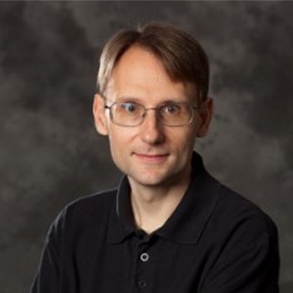 |
|  |  | *Fair Influencers*   [Phebe Vayanos](https://sites.google.com/usc.edu/phebevayanos/)   Assistant Professor of Industrial and Systems Engineering and Computer Science, Viterbi School of Engineering; Associate Director, Center for Artificial Intelligence in Society, Viterbi School of Engineering |  |
| 10:00 | 10:15 | **Break**  |  |
| 10:15 | 11:00 | **Invited Talk II: [Regina Barzilay](https://www.regina.csail.mit.edu), MIT**   Professor of AI and Health, Electrical Engineering & Computer Science, MIT; Member, Computer Science and Artificial Intelligence Laboratory, MIT; AI Faculty Lead, Jameel Clinic, MIT Center for Machine Learning in Health | 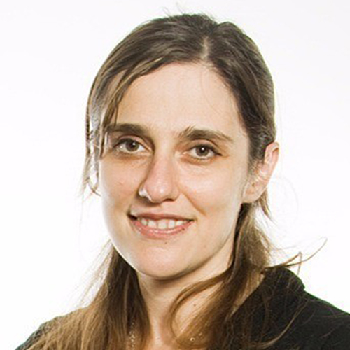 |
| 11:00 | 11:15 | **Break**  |  |
| 11:15 | 12:00 | **Panel II: Health**  |  |
|  |  | Panel Chair: [Greg Ver Steeg](https://www.isi.edu/people/gregv/)   Research Associate Professor, Information Sciences Institute, Viterbi School of Engineering |  |
|  |  | [Neda Jahanshad](https://keck.usc.edu/faculty-search/neda-jahanshad/)   Associate Professor of Neurology, Keck School of Medicine |  |
|  |  | [Peter Kuhn](https://dornsife.usc.edu/cf/faculty-and-staff/faculty.cfm?pid=1057916)   Dean’s Professor of Biological Sciences, Dornsife College of Letters, Arts and Sciences; Professor of Medicine, Biomedical Engineering, Aerospace & Mechanical Engineering and Urology, Dornsife College of Letters, Arts and Sciences |  |
|  |  | [Daniella Meeker](https://keck.usc.edu/faculty-search/daniella-meeker/)   Director of Clinical Research Informatics, Keck School of Medicine; Assistant Professor of Preventive Medicine, Keck School of Medicine | 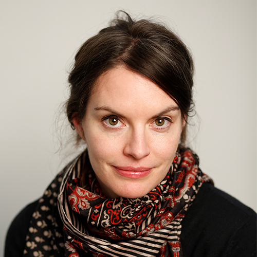 |
| 12:00 | 12:15 | **Closing Remarks**  |  |
|  |  | [Maja Matarić]()   USC Interim Vice President of Research; Chan Soon-Shiong Chair and Distinguished Professor of Computer Science, Neuroscience, and Pediatrics |  |
